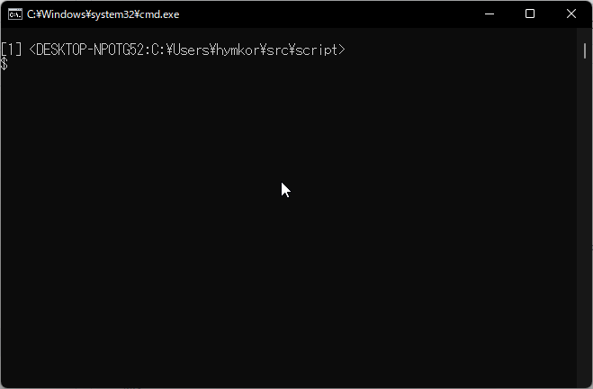

script.exe
==========

- Make typescript of terminal session like [that of Linux](https://www.man7.org/linux/man-pages/man1/script.1.html)
- Windows 10 or later version implemented with [aymanbagabas/go-pty](https://github.com/aymanbagabas/go-pty)

```
script [options] [file]
```

Usage:

- `-a` Append the output to specified file or **"typescript"**
- `-c command` Run the command rather than cmd.exe


